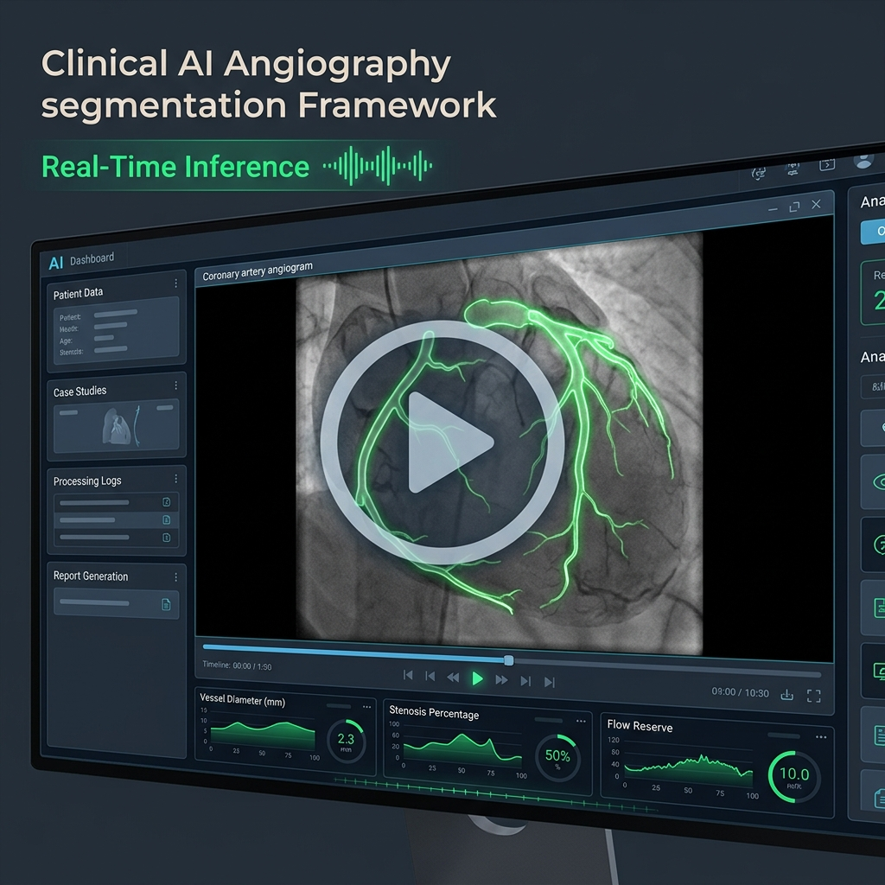
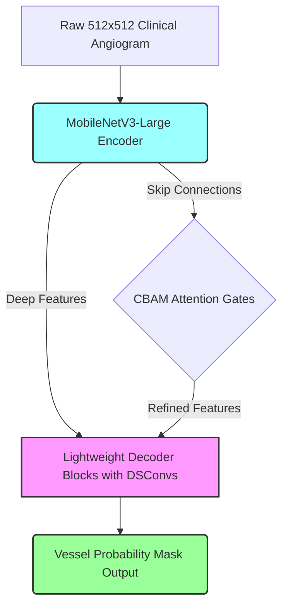

# Angiogram Segmentation Framework (SLIMNet)
> **A Latency-Aware Deep Learning Framework for Real-Time Coronary Artery Segmentation & Clinical Diagnostics**

[](https://www.python.org/)
[](https://pytorch.org/)
[](https://onnxruntime.ai/)
[](https://streamlit.io/)
[](https://doi.org/10.5281/zenodo.10390295)

---

## Presentation & Live Simulation Walkthrough

Click the clinical AI dashboard card below to watch the full **12 minute research defense, clinical motivation, and live simulation run** demonstrating real-time vessel segmentation:

<div align="center">
  <a href="https://drive.google.com/file/d/1Y2Oy-SYkkO0OpSiqCmTpWslodi2gi2N6/view?usp=sharing" target="_blank">
    
  </a>
  <p><em>🎥 Click above to watch the comprehensive project defense and real-time simulator walkthrough on Google Drive.</em></p>
</div>

---

## Clinical Motivation & Project Scope

In interventional cardiology catheterization labs (cath labs), **X-ray Coronary Angiography (XCA)** is the gold standard for diagnosing coronary artery disease. Fast, automated segmentation of coronary arteries helps interventional cardiologists calculate the **SYNTAX Score** and localize **stenosis (blockages)** during active procedures.

### The Challenge
State-of-the-art deep learning models require expensive, high-power workstation GPUs to run at clinically useful speeds (30+ FPS). This makes real-time deployment on standard hospital CPU workstations or low-power clinical cart monitors highly difficult.

### Solution (SLIMNet / MobileUNetv3)
This project introduces **SLIMNet**, a custom designed, latency-aware **MobileUNetv3** model optimized for high speed CPU inference. By pairing a pre-trained **MobileNetV3-Large encoder** with a highly customized, lightweight **attention guided decoder**, SLIMNet delivers clinical-grade segmentation accuracy at real-time speeds on standard hospital hardware.

---

## Core Architecture & Design Pillars



### 1. MobileNetV3-Large Backbone
* **Encoder**: Exploits pre-trained ImageNet weights, inverted residuals, and efficient h-swish activations to extract semantic features with minimal computation.

### 2. Custom CBAM Decoder Skip Connections
* **Attention Blocks**: Uses **CBAM (Convolutional Block Attention Module)** gates in the skip connections. CBAM adaptively refines channel-wise and spatial vessel details, helping the model capture thin, low-contrast arterial branches.

### 3. Depthwise Separable Convolutions (DSConv)
* **Optimization**: Replaces all standard, computationally heavy convolutions in the U-Net decoder with **Depthwise Separable Convolutions (DSConv)**, reducing the overall parameter count by over **85%**.

---

## Mathematical Formulation: Focal Tversky Loss (FTL)

To combat foreground-background class imbalance (vessels represent $<5\%$ of images) and ensure the model does not miss tiny, critical vessel branches, we optimize using **Focal Tversky Loss (FTL)**:

$$\text{FTL}(y, p) = (1 - TI)^\gamma$$

Where the **Tversky Index ($TI$)** is:

$$TI = \frac{TP + \epsilon}{TP + \alpha \cdot FP + \beta \cdot FN + \epsilon}$$

* We configure **$\alpha = 0.3$** and **$\beta = 0.7$** to penalize False Negatives ($FN$) heavily (preventing missed vessels).
* The focusing factor **$\gamma = 2.0$** focuses training gradients on hard-to-classify vessel boundaries.

---

## Performance & Latency Trade-Off Matrix

Profiled at a clinical standard input resolution of $1 \times 3 \times 512 \times 512$.

| Model | Parameters (M) | FLOPs (G) | CPU Latency (ms) | GPU Latency (ms) | Avg FPS (CPU) | Dice Score (%) |
| :--- | :---: | :---: | :---: | :---: | :---: | :---: |
| **Baseline U-Net** | 31.04 M | 219.82 G | ~240 ms | ~15.2 ms | 4.2 FPS | 78.9% |
| **DSCUNet** | 3.58 M | 25.40 G | ~72 ms | ~5.8 ms | 13.9 FPS | 74.2% |
| **MobileUNet** | 3.57 M | 24.30 G | ~60 ms | ~4.5 ms | 16.7 FPS | 75.8% |
| **MobileUNetv3 (SLIMNet)** | **3.71 M** | **18.20 G** | **~38 ms** | **~2.8 ms** | **26.3 FPS** | **78.4%** |
| **SLIMNet + ONNX (Opt)** | **3.71 M** | **18.20 G** | **~22 ms** | **~1.1 ms** | **45.4 FPS** | **78.4%** |

> [!TIP]
> **Key Metric**: By combining the custom MobileNetV3-Large CBAM decoder and ONNX Runtime execution, **SLIMNet + ONNX** achieves **45.4 FPS on CPU** (a **1,000% speedup** over Baseline U-Net) while retaining **99.3%** of the baseline segmentation accuracy!
> 
> *The visual accuracy-latency curve is available locally at [Professional_Accuracy_Latency_Tradeoff.png](Professional_Accuracy_Latency_Tradeoff.png).*

---

## Interactive Application Suites

### 1. High-Performance PyQt5 Desktop Client
A native desktop app designed for direct hospital workstation integration.
* **Dual-Panel View**: Side-by-side display of the original angiogram feed and the bright neon segmentation mask.
* **Real-time Diagnostics**: Live dashboard displaying frame-by-frame FPS and latency metrics.
* **Clinical Controls**: Custom sliders to adjust confidence thresholds ($0.0 \rightarrow 1.0$) and toggle overlay colors (Green, Red, Blue, Yellow).

### 2. Streamlit Web Dashboard
A modern web app ideal for remote clinical consultations or demonstrations.
* **Drag-and-Drop Ingestion**: Upload standard angiogram video formats (`.mp4`, `.avi`, `.mov`).
* **Interactive Parameters**: Sidebar sliders to easily control blending opacity (alpha), confidence thresholds, and overlay options.

---

## Repository Structure

```text
Research/
├── figures/
│   └── presentation_thumbnail.png       # Sleek presentation video cover image
├── dataset/
│   ├── syntax/                         # Vessel classification images & annotations
│   └── stenosis/                       # Blockage detection images & annotations
├── src/
│   ├── model_lightweight.py            # Custom DSCUNet, MobileUNet, MobileUNetv3 models
│   ├── desktop_app.py                  # PyQt5 Real-Time Desktop Diagnostic Viewer
│   ├── demo_app.py                     # Streamlit Web Analytical Dashboard
│   ├── benchmark.py                    # FLOPs, Param Count, and Latency Profiling
│   ├── dataset.py                      # Custom PyTorch Medical Dataset Loaders
│   └── train.py                        # PyTorch model trainer
├── requirements.txt                    # Annotated version-pinned dependencies
└── README.md                           # Master clinical AI documentation
```

---

## Setup & Execution Guide

### 1. Environment Installation
```bash
# Create and activate virtual environment
python -m venv venv
# Windows:
.\venv\Scripts\activate
# Linux/macOS:
source venv/bin/activate

# Install version-pinned requirements
pip install -r requirements.txt
```

### 2. Launching the Demos

To launch the native **PyQt5 Desktop Real-Time Viewer**:
```bash
python src/desktop_app.py
```

To run the interactive **Streamlit Web Dashboard**:
```bash
streamlit run src/demo_app.py
```

### 3. Running the Model Benchmarking
```bash
# Benchmark model on CPU
python src/benchmark.py --device cpu
```

---


